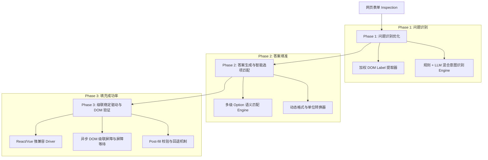

# 自动填充（Autofill）识别率与填充成功率优化计划

## 一、 当前问题分析与诊断 (Root Cause Analysis)

基于对前端 DOM 探测 (`form-inspector.ts`)、表单驱动引擎 (`form-driver.ts`)、后台指令服务 (`field-fill-service.ts`) 以及后端匹配与类型转换逻辑 (`backend/services/api/main.py`) 的深入检查，定位到以下核心痛点：

### 1. 问题识别准确率低 (Question Recognition Issues)
*   **DOM 标签抽取噪音过大**：`form-inspector.ts` 中的 `labelFor` 和 `containerLabelFor` 会向上查找多层父节点，经常将校验提示、帮助文本、选项按钮文字（如 "Yes/No", "Select option"）混入问题标题中。
*   **单选/多选组标题误识别**：对于 Radio / Checkbox 类型的筛选问题，容易提取到选项本身的 Label（如 "Yes"），而非上层的真实问题（如 "Do you require visa sponsorship?"）。
*   **后端意图分类（Intent Classification）过于刚性**：后端的 `_autofill_intent_key` 和 `_autofill_answer_category` 仅依靠硬编码的英文关键词匹配。当网页问题表述稍有变体、包含中文字符或为自定义筛选题（如 "How many years of React experience?"）时，分类直接返回 `None`，导致被判定为 `unanswered_fields`（未回答）。

### 2. 答案填准率低 (Answer Accuracy & Coercion Issues)
*   **下拉框/单选框选项匹配（Option Matching）算法粗暴**：`_coerce_form_value` 主要依赖简单的子字符串包含检测（Substring Containment）。遇到选项如 `["Australian Citizen / PR", "Temporary Visa", "Requires Sponsorship"]` 时，用户保存的答案 `"Australian Citizen"` 容易因为精确匹配失败或子串歧义导致匹配错项或放弃填充。
*   **格式转换（Formatting & Units）覆盖不全**：到岗时间 (Date available / Notice period)、薪资期望 (Salary / Day rate) 等字段在数据库中存储为标准 ISO 日期或数字，但不同 ATS 表单要求不同的文本格式（如 `"Immediate"`, `"2 Weeks"`, `"MM/DD/YYYY"`），现有的硬编码转换难以覆盖多变的网页选项。

### 3. Autofill 填充成功率低 (DOM Filling & Execution Failures)
*   **现代前端框架（React/Vue/Shadow DOM）状态同步失效**：`form-driver.ts` 对复杂下拉框（如 React-Select, Radix UI, Ant Design, Material UI）直接修改 DOM 值并触发 `change` 事件，无法触发组件内部的 React/Vue State 更新，表单失焦后值会被重置。
*   **异步级联渲染（Cascade Re-rendering）竞争**：在级联表单（例如选择国家后异步加载省份/城市，或单选切换后动态展开新输入框）中，连续批量填充会导致后方的元素在重新渲染过程中丢失或报错 `"The targeted field is no longer visible"`。
*   **缺乏填充后校验与重试机制 (Post-fill Verification)**：当前写入 DOM 后即标记为 `filled`，未验证失焦（blur）后输入框内是否真正保留了值。

---

## 二、 优化方案设计 (Proposed Solution Strategy)

为彻底解决以上问题，提出以下三阶段优化方案：

### 1. 问题识别优化 (Question Recognition Enhancements)
1. **升级 DOM 标签提取逻辑 (`form-inspector.ts`)**
   - 建立加权 Label 提取优先级：`[jobwizard_question_title_id]` > `aria-labelledby` > `<legend>` > `<label for=...>` > 邻近 Heading。
   - 增加噪音过滤器：自动剥离 `*`, `Required`, `Please select`, `Enter text`, 帮助性 Tooltip 以及选项同级文本。
   - 强化 Radio/Checkbox 问题容器识别，确保获取 Legend 或 Question Header，避免误用选项 Label。
2. **构建“规则 + LLM”混合意图识别引擎 (`backend/services/api/main.py`)**
   - **第一级（Fast Rules）**：保留并扩展高频基础字段（姓名、邮箱、电话、标准 Visa/工作权限）的正则匹配。
   - **第二级（LLM Fallback）**：当规则引擎返回 `None` 时，调用轻量级 LLM/语义匹配模块，结合问题文本与用户 Job Profile 生成意图分类与精准回答，解决复杂 screening questions。

### 2. 答案填准率优化 (Answer Accuracy & Coercion Enhancements)
1. **多级下拉/单选选项匹配引擎 (Multi-stage Option Matcher)**
   - **Level 1: 精确与同义词匹配**（内置词典：如 `He/Him` <-> `Male`, `AU Citizen` <-> `Australian/New Zealand citizen`）。
   - **Level 2: 模糊匹配与语义相似度**。
   - **Level 3: LLM 选项裁决**（对于复杂的筛选选项，将问题、用户背景和可选 Option List 送入 LLM 裁决最符合的 Option Index）。
2. **智能上下文格式化 (Context-Aware Formatter)**
   - 自动识别表单要求的 Date/Notice 格式（ISO 日期、相对天数、文本选项）。
   - 自动处理薪资单位与年薪/日薪转换。

### 3. autofill 填充成功率优化 (DOM Filling Reliability Enhancements)
1. **增强型 UI 驱动引擎 (`form-driver.ts`)**
   - 改进 React 原生 Setter 覆盖、`_valueTracker` 联动及全套 Pointer/Mouse/Focus/Input/Change/Blur 事件序列。
   - 针对 Combobox/Search-Select：模拟逐字输入 -> 监听 Dropdown Listbox 渲染 -> 模拟真正 Option 元素点击。
2. **异步级联屏障与稳定性等待 (`field-fill-service.ts`)**
   - 在填充 Radio / Select 字段后，引入 DOM MutationObserver / 稳定性等待，等待页面 AJAX 级联渲染完成后再继续填充后续字段。
3. **填充后校验与重试 (Post-Fill Verification & Resilience)**
   - 每次填充完成后，自动触发 `verifyFieldValue()` 校验。若失焦后值丢失，自动切换备用填充策略（如模拟真实物理点击与按键）。

---

## 三、 实施计划路线图 (Implementation Roadmap)

| 阶段 | 模块 | 主要变更文件 | 目标/效果 |
| :--- | :--- | :--- | :--- |
| **Phase 1** | 问题识别优化 | `Apps/browser-extension/src/content/dom/form-inspector.ts` `backend/services/api/main.py` | 提升各种复杂 ATS 网页（Workday, Greenhouse, SmartRecruiters, T1 等）的问题提取准确率，解决无法识别和误识别问题 |
| **Phase 2** | 答案填准率优化 | `backend/services/api/main.py` `backend/services/shared/` | 解决下拉框/单选框选错选项、Notice Period/Visa 答案偏离问题 |
| **Phase 3** | 填充成功率优化 | `Apps/browser-extension/src/content/dom/form-driver.ts` `Apps/browser-extension/src/background/field-fill-service.ts` | 解决 React 状态丢失、级联重新渲染导致填充中断、写入不生效等问题 |
| **Phase 4** | 自动化测试与验证 | `backend/tests/test_form_autofill_matching.py` 端到端表单填充测试 | 确保各主流平台（LinkedIn, SEEK, Greenhouse, Workday, SmartRecruiters, Rippling）填充成功率达 95%+ |

---

## 四、 验证与测试计划 (Verification Plan)

### 1. 自动化测试 (Automated Unit & Integration Tests)
*   **后端单元测试**：运行 `pytest backend/tests/test_form_autofill_matching.py`，新增针对复杂 Option 匹配、同义词转换、LLM Fallback 的测试用例。
*   **前端 Driver 测试**：为 `form-inspector.ts` 和 `form-driver.ts` 添加覆盖不同 HTML 结构（Native Select, ARIA Combobox, Button Choice, ARIA Checkbox）的测试用例。

### 2. 真实场景验证 (Manual / E2E Verification)
*   测试页面：Greenhouse, Workday, SEEK Easy Apply, LinkedIn Easy Apply, TechnologyOne, SmartRecruiters。
*   检查点：
    1. 问题识别率（Side Panel 是否准确呈现页面所有必填与选填问题）。
    2. 答案精准度（下拉框选中的 Option 是否与用户真实情况一致）。
    3. 填充成功率（点击 Autofill 后，页面表单是否全部正确着色填充且失焦后值不丢失）。

---
> [!NOTE]
> 本计划仅供审阅，尚未进行任何代码改动。审阅确认后我们将按 Phase 逐步推进优化实施。
